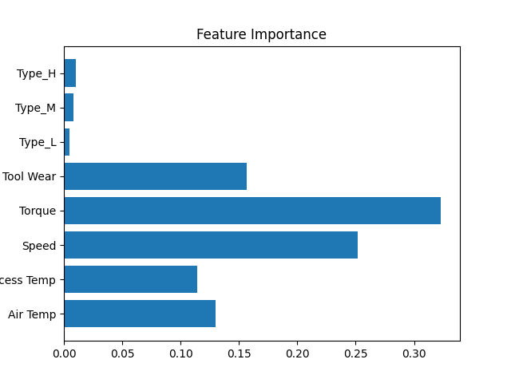
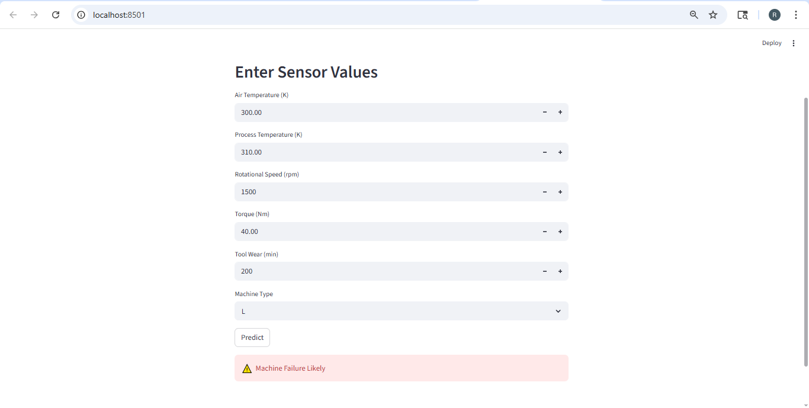

# 🔧 AI-Powered Predictive Maintenance System for IoT Devices

---

## 📌 Overview

This project is an **AI-based Predictive Maintenance System** that uses machine learning to predict machine failures using IoT sensor data.

It helps industries **prevent breakdowns, reduce downtime, and improve efficiency**.

---

## 🚨 Problem Statement

Industries suffer from:

* Unexpected machine failures
* High maintenance costs
* Production downtime

Traditional maintenance approaches:

* Reactive Maintenance (after failure) ❌
* Scheduled Maintenance (inefficient) ❌

---

## 💡 Solution

This system predicts machine failure in advance using:

* Sensor data (temperature, speed, torque, tool wear)
* Machine Learning model (Random Forest Classifier)

---

## 🏭 Industry Applications

* Manufacturing plants
* Automotive industry
* Power plants
* Aviation systems

---

## ⚙️ Tech Stack

* Python
* Pandas, NumPy
* Scikit-learn
* Matplotlib
* Streamlit

---

## 📊 Dataset

* AI4I Predictive Maintenance Dataset
* Includes:

  * Air Temperature
  * Process Temperature
  * Rotational Speed
  * Torque
  * Tool Wear
  * Machine Failure

---

## 🧠 Features

* Data preprocessing
* Feature engineering
* Machine learning model training
* Failure prediction system
* Visualization (confusion matrix, feature importance)
* Interactive Streamlit web application

---

## 🏗️ Project Structure

```
AI-Predictive-Maintenance-IoT/
│
├── main.py
├── app.py
├── requirements.txt
├── README.md
│
├── src/
│   ├── preprocess.py
│   ├── train.py
│   ├── predict.py
│   └── visualize.py
│
├── images/
│   ├── confusion_matrix.png
│   ├── feature_importance.png
│   └── op.png
```

---

## ▶️ How to Run

### 1. Install dependencies

```
pip install -r requirements.txt
```

### 2. Train the model

```
python main.py
```

### 3. Run the web app

```
python -m streamlit run app.py
```

---

## 📈 Results

### 🔹 Model Performance (Confusion Matrix)


---

### 🔹 Feature Importance



---

### 🔹 Streamlit UI Output



---

## 🎯 Key Results

* Achieved high prediction accuracy (~95%+)
* Successfully predicted machine failures
* Built real-time prediction interface using Streamlit

---

## 🎓 Learning Outcomes

* End-to-end Machine Learning pipeline
* Predictive maintenance in real-world scenarios
* Data preprocessing and feature engineering
* Model deployment using Streamlit
* GitHub project structuring

---

## 🚀 Future Improvements

* Use deep learning models (LSTM for time-series data)
* Deploy using cloud (AWS / Azure)
* Integrate real-time IoT sensor data

---

## 👩‍💻 Author

Rakshitha A S

---

## ⭐ Support

If you like this project, give it a ⭐ on GitHub!
